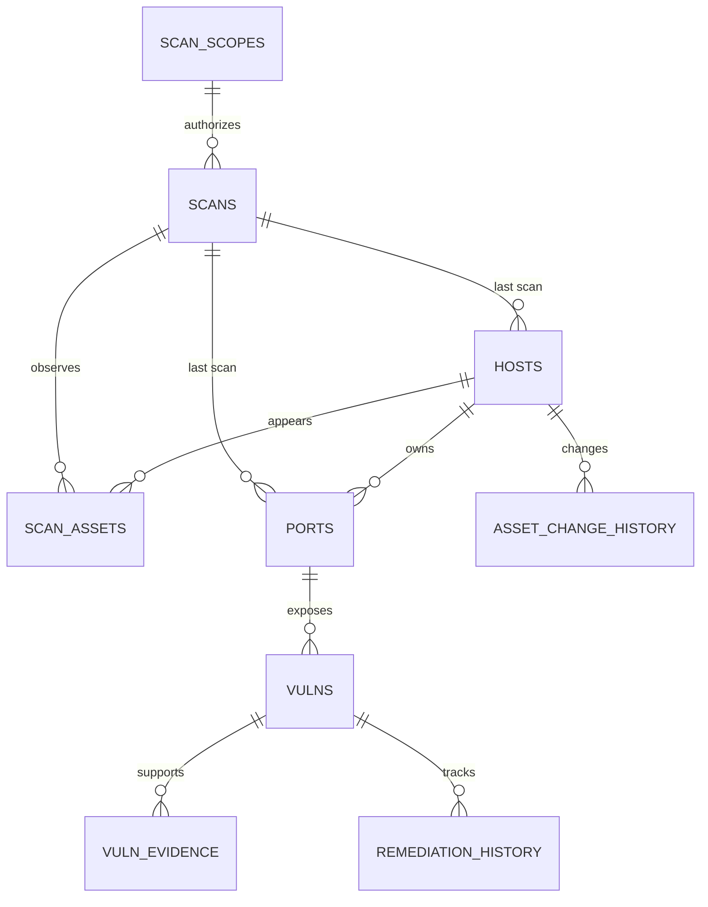
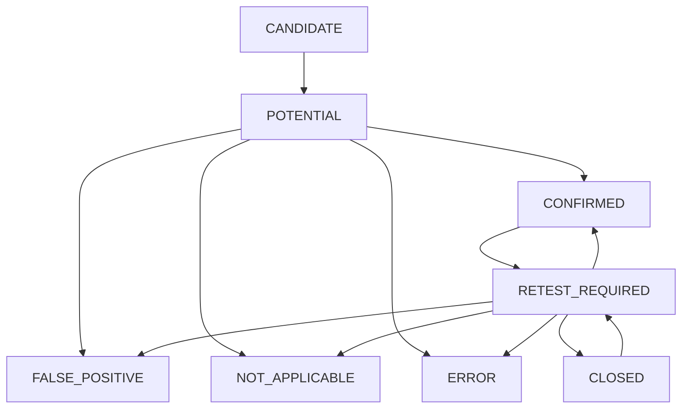

# Port Scanner Database Schema V3

## 1. 개선 목적

기존 스키마는 취약점 상태가 `POTENTIAL`, `CONFIRMED`,
`REJECTED`로 제한되어 있었지만 검증 코드는 `INVALID`,
`ERROR`, `SKIP`도 반환했다.

이번 개선에서는 다음 요구사항을 반영했다.

- 스캔, 자산, 포트, 취약점, 검증 증적, 조치 이력 분리
- 동일 취약점의 중복 저장 방지
- 탐지부터 조치 완료까지 상태 추적
- 검증 결과와 스크린샷의 증적 관리
- 기존 V1 데이터 보존 마이그레이션
- 승인된 스캔 범위와 정책 해시 보존
- 자산 중요도·담당자·환경·데이터 등급 관리
- 스캔별 자산 관찰 및 자산 변경 감사이력

## 2. 테이블 관계



## 3. 테이블별 역할

### scan_scopes

허가된 스캔 범위, 승인 근거, 유효기간과 실행 한도를 관리한다.
`policy_sha256`은 정규화된 스코프 정책의 SHA-256 값이다.

### scans

한 번의 포트 스캔 실행을 기록한다.

| 필드 | 의미 |
|---|---|
| `id` | DB 내부 숫자 식별자 |
| `scan_uid` | 애플리케이션에서 생성한 고유 스캔 ID |
| `scope_id` | 승인 스코프의 DB ID |
| `target` | 스캔 대상 |
| `requested_targets` | 사용자가 입력한 IP·CIDR·호스트 목록 |
| `scan_type` | TCP, UDP 또는 TCP+UDP |
| `port_range` | 검사한 포트 범위. V3.1부터 MEDIUMTEXT, 연속 포트는 `1-1024`처럼 저장 |
| `status` | 스캔 실행 상태 |
| `config_snapshot` | 실행 당시 설정 |

`scan_uid`에는 UNIQUE 제약조건을 적용해 같은 스캔 결과가
중복 저장되지 않도록 한다.

### hosts

발견한 호스트를 자산대장으로 관리한다.

| 필드 | 의미 |
|---|---|
| `host_ip` | IPv4 또는 IPv6 주소 |
| `asset_uid` | IP와 독립된 UUID 자산 식별자 |
| `host_name` | 역방향 DNS 조회 결과 |
| `asset_name` | 업무 자산명 |
| `asset_type` | 자산 유형 |
| `environment` | 운영·개발·테스트 등 환경 |
| `criticality` | 업무 중요도 |
| `owner` | 담당자 |
| `data_classification` | 데이터 분류 등급 |
| `handles_personal_data` | 개인정보 처리 여부 |
| `internet_exposed` | 인터넷 노출 여부 |
| `lifecycle_status` | 활성·비활성·폐기 상태 |
| `first_seen` | 최초 발견 시각 |
| `last_seen` | 최근 발견 시각 |
| `last_scan_id` | 최근 확인한 스캔의 DB ID |

`host_ip`에는 UNIQUE 제약조건을 적용한다.

### scan_assets

한 번의 스캔과 여러 자산을 연결한다. 원래 입력값, IP 해석 방식,
스캔 결과와 열린 포트 수를 실행별로 보존한다.

### asset_change_history

자산 중요도, 담당자, 환경, 수명주기 상태 등의 변경 전후 값과
사유·변경자를 보존한다.

### ports

자산별 네트워크 포트와 서비스 식별 결과를 관리한다.

중복 판단 기준은 다음 세 필드의 조합이다.

```text
host_id + port + protocol
```

같은 포트를 다시 스캔하면 새 행을 만들지 않고 서비스,
버전, 배너, 상태, 마지막 발견 시각을 갱신한다.

### vulns

포트에서 발견한 취약점 후보와 위험도를 관리한다.

중복 판단 기준은 다음 세 필드의 조합이다.

```text
port_id + cve_id + source
```

재분석 시 EPSS, CVSS, 위험도와 마지막 탐지 시각은 갱신하지만
이미 검증되거나 조치된 상태는 `POTENTIAL`로 되돌리지 않는다.

### vuln_evidence

취약점 검증 과정에서 생성한 증적을 저장한다.

| 증적 유형 | 의미 |
|---|---|
| `HTTP_RESPONSE` | HTTP 상태 및 응답 확인 결과 |
| `SCREENSHOT` | 웹 서비스 화면 캡처 |
| `NUCLEI` | Nuclei 템플릿 검증 결과 |
| `BANNER` | FTP 등 서비스 배너 검증 결과 |
| `MANUAL` | 수동 점검 증적 |
| `ERROR_LOG` | 검증 도구 실행 오류 |

파일 증적에는 SHA-256 값을 함께 저장할 수 있다. 이를 통해
수집 이후 파일이 변경됐는지 확인할 수 있다.

### remediation_history

취약점 상태 변경과 조치 내역을 시간순으로 보존한다.

| 필드 | 의미 |
|---|---|
| `from_status` | 변경 전 상태 |
| `to_status` | 변경 후 상태 |
| `action_type` | 상태 변경, 재점검, 조치, 종료, 재개 |
| `reason` | 변경 또는 판단 사유 |
| `changed_by` | 변경 주체 |
| `changed_at` | 변경 시각 |

현재 상태만 저장하는 방식과 달리 누가, 언제, 왜 상태를
변경했는지 확인할 수 있다.

## 4. 표준 상태값

### 스캔 상태

| 상태 | 의미 |
|---|---|
| `QUEUED` | 실행 대기 |
| `RUNNING` | 실행 중 |
| `COMPLETED` | 정상 완료 |
| `PARTIAL` | 일부 대상만 완료 |
| `FAILED` | 전체 실행 실패 |

### 취약점 상태

| 상태 | 의미 |
|---|---|
| `CANDIDATE` | 규칙으로 식별된 초기 후보 |
| `POTENTIAL` | 분석을 마쳤으며 검증이 필요한 상태 |
| `CONFIRMED` | 기술적 검증으로 확인된 취약점 |
| `NOT_APPLICABLE` | 대상 서비스에 검증을 적용할 수 없음 |
| `FALSE_POSITIVE` | 취약점이 재현되지 않음 |
| `RETEST_REQUIRED` | 조치 후 재점검이 필요한 상태 |
| `CLOSED` | 조치와 재점검이 완료된 상태 |
| `ERROR` | 검증 도구 또는 실행 환경 오류 |

## 5. 상태 흐름



`POTENTIAL`에서 바로 `CLOSED`로 변경하지 않는다. 먼저 실제
취약점임을 확인하고 조치 및 재점검 과정을 거치도록 제한한다.

## 6. 기존 상태 변환

| V1 값 | V2 값 |
|---|---|
| 스캔 `DONE` | `COMPLETED` |
| 취약점 `REJECTED` | `FALSE_POSITIVE` |
| 검증기 `INVALID` | `FALSE_POSITIVE` |
| 검증기 `SKIP` | `NOT_APPLICABLE` |

검증기의 원본 결과는 `vuln_evidence.details`에 보존하고,
`vulns.status`에는 표준화한 상태만 저장한다.

## 7. 설치 및 마이그레이션

### 신규 설치

빈 MySQL 볼륨에서 Docker Compose를 시작하면
`sql/init.sql`이 자동으로 실행된다.

```powershell
docker compose -f .\docker\docker-compose.yml up -d
```

### 기존 V1 DB

`sql/migration_v2.sql`을 한 번만 실행한다.

마이그레이션은 다음 백업 테이블을 먼저 생성한다.

- `migration_backup_scans_v1`
- `migration_backup_hosts_v1`
- `migration_backup_ports_v1`
- `migration_backup_vulns_v1`

기존 문자열 `last_scan_id`는 삭제하지 않고
`legacy_last_scan_uid`로 이름을 변경해 보존한다.

V1 DB는 먼저 V2 마이그레이션과 검증을 완료해야 한다.

### 기존 V2 DB

DB 덤프를 만든 뒤 `sql/migration_v3.sql`을 한 번 실행한다.
이어서 `sql/migration_v3_1.sql`로 포트 범위 저장 컬럼을 확장한다.
자세한 명령과 검증 기준은 `docs/asset_management.md`에 있다.

### 기존 V3 DB

현재 DB를 백업한 뒤 `sql/migration_v3_1.sql`만 실행한다.
`scans.port_range`를 VARCHAR(100)에서 MEDIUMTEXT로 확장하여
여러 개의 떨어진 포트를 지정한 긴 목록도 보존한다.
애플리케이션은 실제 검사한 포트를 `22,80-82,443`처럼 정리하며,
사용자 입력 원문은 `scans.config_snapshot`의 `ports`에 보존한다.

## 8. 검증 SQL

```sql
SHOW TABLES;

SHOW COLUMNS FROM scans;
SHOW COLUMNS FROM scan_scopes;
SHOW COLUMNS FROM hosts;
SHOW COLUMNS FROM scan_assets;
SHOW COLUMNS FROM asset_change_history;
SHOW COLUMNS FROM vulns;
SHOW COLUMNS FROM vuln_evidence;
SHOW COLUMNS FROM remediation_history;

SELECT status, COUNT(*)
FROM vulns
GROUP BY status;

SELECT
    port_id,
    cve_id,
    source,
    COUNT(*) AS duplicate_count
FROM vulns
GROUP BY
    port_id,
    cve_id,
    source
HAVING COUNT(*) > 1;
```

마지막 중복 검사 결과가 0행이면 UNIQUE 기준에 맞게 정리된
상태다.

## 9. 운영 및 보안 관점

- MySQL 포트는 `127.0.0.1`에만 바인딩한다.
- DB 비밀번호는 `.env`에서만 관리하고 커밋하지 않는다.
- 취약점 상태 변경 사유와 변경 주체를 이력으로 남긴다.
- 검증 결과와 증적 파일의 SHA-256 값을 연결한다.
- 자동 분석이 검증 완료 상태를 임의로 되돌리지 않게 한다.
- 중복 방지는 애플리케이션과 UNIQUE 제약조건 양쪽에서
  수행한다.
- 스캔 전에 승인 범위와 유효기간 및 실행 한도를 검증한다.
- 자산 메타데이터 변경에는 변경자와 사유를 반드시 남긴다.
